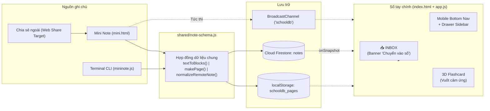

# 📋 BÁO CÁO PHIÊN LÀM VIỆC & TỔNG KẾT NÂNG CẤP (v3.0)

> **Dự án:** School NoteBook  
> **Thời gian:** 06/10/2026  
> **Phiên bản:** v3.0  
> **Git Commit:** [`688193e`](https://github.com/schoollovewater/School_NoteBook/commit/688193ea07b17e3e8d9d9621d75acac8ef063d04)  
> **Nhánh:** `main` (Đã đồng bộ với GitHub)

---

## 1. Bối cảnh & Yêu cầu của Người dùng

1. **Khởi đầu phiên làm việc:** Đọc lại tài liệu `README.md` và `PROJECT_MANUAL.md` để nắm bắt hiện trạng dự án (v2.6).
2. **Yêu cầu trọng tâm từ người dùng:** 
   - Kiểm tra mã nguồn xem có **Mini App** hay không và đề xuất phương án tối ưu.
   - Lập kế hoạch chi tiết thiết kế lại Mini App của ứng dụng ghi chú tổng.
   - Đưa ra và triển khai giải pháp tối ưu cho **cả 2 ứng dụng (Sổ tay chính & Mini Note) trên điện thoại di động**.
3. **Yêu cầu đóng gói:** Đóng gói toàn bộ cuộc trò chuyện, phân tích, sửa đổi kỹ thuật và kết quả thành tệp tài liệu Markdown lưu trữ trực tiếp trong dự án.

---

## 2. Kiểm toán Kỹ thuật (Audit) — Các vấn đề phát hiện trước khi sửa

| STT | Vấn đề phát hiện | Chi tiết kỹ thuật & Hậu quả | Mức độ |
|---|---|---|---|
| 1 | **Ghi chú từ Mini Note không bao giờ hiển thị trên Web Tổng** | `mini.html` và `mininote.js` đẩy dữ liệu lên Firestore dạng `{title, content}`. Tuy nhiên trong `app.js`, logic nhận chỉ chấp nhận `if (data.blocks)`. Ghi chú mini không có trường `blocks` nên bị bỏ qua hoàn toàn. Ngoài ra `mini.html` không lưu vào `localStorage` cục bộ của Sổ tay. | 🔴 Nghiêm trọng |
| 2 | **Nút mở menu ☰ trên điện thoại bị tê liệt** | Thẻ `<button id="toggle-sidebar">` trong `index.html` hoàn toàn không có bất kỳ event listener nào trong `app.js`. Người dùng trên điện thoại không thể mở danh sách trang. | 🔴 Nghiêm trọng |
| 3 | **Chưa có Service Worker (`sw.js`)** | Ứng dụng PWA chưa thể chạy offline đúng nghĩa; khi ngắt kết nối mạng thì ứng dụng không thể tải lại tài nguyên. | 🟠 Quan trọng |
| 4 | **Mất dữ liệu nháp trong Mini Note** | Toàn bộ dữ liệu các tab trong Mini Note chỉ nằm trong biến RAM (`let notes = [...]`). Khi reload, chuyển tab hoặc đóng trình duyệt, toàn bộ ghi chú đang viết dở bị mất. Chưa có nút đóng/xóa từng tab. | 🟠 Quan trọng |
| 5 | **SortableJS cướp thao tác cuộn trang trên màn hình cảm ứng** | Kéo thả khối trong trình soạn thảo bắt sự kiện chạm ngay lập tức, khiến việc vuốt ngón tay để cuộn văn bản trên mobile bị nhận nhầm thành kéo khối. | 🟠 Quan trọng |
| 6 | **Lỗi chiều cao `100vh` trên trình duyệt di động** | Đơn vị CSS `100vh` không trừ chiều cao thanh địa chỉ/thanh công cụ trên iOS Safari và Android Chrome, làm nội dung bị che khuất ở cạnh dưới. | 🟡 Cần xử lý |
| 7 | **Tàn dư thương hiệu cũ trong CLI** | `mininote.js` vẫn in ra thông báo cũ: `"👉 Mở website EngiHub để xem ghi chú mới..."`. | 🟢 Nhỏ |

---

## 3. Kế hoạch & Kiến trúc Giải pháp

Toàn bộ kế hoạch được xây dựng dựa trên nguyên lý **Quick-Capture Pipeline**:
- **Mini Note** = Trình ghi nhanh mở trong 1-2 giây, tập trung nhập liệu tốc độ cao, không cần suy nghĩ về vị trí lưu.
- **Hộp thư đến (📥 INBOX)** = Nơi hứng toàn bộ ghi chú nhanh từ Mini Note, CLI và ứng dụng ngoài.
- **Sổ tay chính (School NoteBook)** = Nơi sắp xếp, tổ chức khối, chỉnh sửa chuyên sâu và ôn tập Flashcard 3D.



---

## 4. Chi tiết các Thay đổi theo từng Tệp tin

### 4.1. `shared/note-schema.js` (Tạo mới)
- Xây dựng hợp đồng dữ liệu chung chuẩn hóa theo Universal Module Definition (chạy được cả trình duyệt và Node.js CLI).
- Hàm `textToBlocks(text, opts)`: Tự động phân tích văn bản Markdown thô thành các khối của trình soạn thảo (`#` → h1, `##` → h2, `-` → bullet, `[]` → todo, `>` → quote, ` ``` ` → code). Hỗ trợ `forceType: 'todo'` biến mọi dòng thành việc cần làm.
- Hàm `normalizeRemoteNote(docId, data)`: Nhận diện và tự động chuyển đổi (migrate) các ghi chú cũ từ dạng thô `{title, content}` sang cấu trúc khối `blocks` chuẩn.
- Hàm `makeVocabItem(data)`: Chuẩn hóa item từ vựng 4 nhóm phân loại (`TechAdvanced`, `TechCommon`, `TOEIC`, `Other`).

### 4.2. `mini.html` (Thiết kế lại toàn diện — Mini Note v2)
- **Giao diện thích ứng (Responsive):**
  - Màn hình điện thoại (< 640px): Dải tab ngang trượt mượt mà phía trên, tối ưu 100% chiều ngang cho khung nhập liệu.
  - Màn hình máy tính (≥ 640px): Thang tab dọc bên trái trực quan.
- **3 Chế độ nhập liệu:** Ghi chú (Note), Việc cần làm (Todo list), Từ vựng nhanh (Vocab card).
- **Tự lưu nháp thời gian thực (Auto-save draft):** Lưu vào `localStorage.mini_drafts`. F5, reload hay đóng trình duyệt không bị mất dữ liệu.
- **Quản lý tab:** Thêm tab (`+`), đóng tab (`✕`, có hộp thoại xác nhận nếu tab có nội dung chưa gửi).
- **Nhập liệu bằng giọng nói (Voice Typing):** Tích hợp Web Speech API tiếng Việt (`vi-VN`) 🎤.
- **Tích hợp Web Share Target:** Nhận tiêu đề, văn bản, đường dẫn chia sẻ từ các ứng dụng khác trên Android/Chrome.
- **Phím tắt:** `Ctrl + Enter` (gửi ngay), `Alt + N` (thêm tab), `Alt + W` (đóng tab), `Alt + 1..9` (nhảy tab).

### 4.3. `app.js` (Nâng cấp Logic Sổ tay chính)
- **Hệ thống Inbox & Tự động di chuyển dữ liệu cũ:**
  - Lắng nghe thời gian thực từ Cloud Firestore qua `onSnapshot`.
  - Tự động phát hiện và chuyển đổi các ghi chú cũ sang định dạng mới có `blocks`.
  - Phân loại trang có `inbox: true` vào mục **📥 INBOX** trên sidebar.
  - Bổ sung hàm `moveToNotebook()`: 1-click đưa ghi chú từ Inbox vào cây trang chính thức.
- **Đồng bộ thời gian thực hai chiều (Local & Cloud):**
  - Sử dụng `BroadcastChannel('schooldb')`: Khi bấm gửi từ Mini Note, Sổ tay chính nhận ngay lập tức mà không cần kết nối mạng.
- **Tối ưu cử chỉ cảm ứng di động:**
  - Viết hàm `initMobile()`: Xử lý nút mở sidebar `#toggle-sidebar`, cử chỉ vuốt ngón tay từ mép trái màn hình để mở Drawer, chạm lớp phủ `#sidebar-overlay` để đóng.
  - Flashcard 3D: Vuốt sang phải = Đã thuộc, Vuốt sang trái = Cần ôn, Chạm = Lật thẻ.
  - SortableJS: Bổ sung `delay: 220ms` (`delayOnTouchOnly: true`) để cuộn trang bình thường không bị cướp thao tác kéo khối.

### 4.4. `index.html` (Nâng cấp Cấu trúc Giao diện)
- Thêm lớp phủ mờ `#sidebar-overlay` cho Drawer di động.
- Thêm mục `#inbox-section`, danh sách `#inbox-list`, bộ đếm `#inbox-count`.
- Thêm thanh điều hướng đáy di động `#mobile-bottom-nav` gồm 5 phím: *Trang (kèm badge đỏ số bài Inbox), Tìm kiếm, Ghi nhanh (nút tròn nổi bật), Tạo mới, Kho từ vựng*.
- Thêm banner thông báo `#inbox-banner` với nút *"Chuyển vào sổ"*.
- Nạp thư viện dùng chung `shared/note-schema.js` và ghim phiên bản SortableJS 1.15.2.

### 4.5. `styles.css` (Nâng cấp Hệ thống Giao diện)
- Chuyển toàn bộ khung ứng dụng sang chiều cao động `height: 100dvh` (Dynamic Viewport Height).
- Bổ sung các biến vùng an toàn tai thỏ: `padding-bottom: env(safe-area-inset-bottom)`.
- Định dạng Drawer di động trượt từ cạnh trái với đổ bóng và animation mượt mà.
- Thiết kế thanh Mobile Bottom Navigation dạng kính mờ (Glassmorphism).
- Hiệu ứng viền phát sáng xanh/đỏ khi vuốt thẻ Flashcard (`.swipe-right`, `.swipe-left`).
- Tự động chuyển menu `/` và bảng chọn Emoji/Cover thành Bottom Sheet trượt từ dưới lên trên màn hình nhỏ.

### 4.6. `mininote.js` (Nâng cấp CLI Terminal)
- Nhập trực tiếp thư viện `NoteSchema`.
- Chuyển đổi văn bản thành `blocks`, gắn cờ `source: 'cli'`, `inbox: true`.
- Hỗ trợ thêm cờ `--todo` để tạo danh sách công việc trực tiếp từ dòng lệnh.
- Cập nhật thương hiệu chuẩn School NoteBook.

### 4.7. `sw.js` (Tạo mới Service Worker) & PWA Manifests
- Tự động cache các tài nguyên tĩnh cốt lõi (HTML, CSS, JS, Google Fonts, RemixIcon).
- Cơ chế Stale-While-Revalidate cho tài nguyên CDN và Network-First có fallback cho các trang ứng dụng.
- Cập nhật `manifest.json` và `manifest-mini.json` với App Shortcuts và Web Share Target.
- Sinh sẵn icon độ phân giải cao `icons/icon-192.png` và `icons/icon-512.png` thay thế file ảnh gốc nặng 750KB.

---

## 5. Kết quả Kiểm thử Tự động (Browser Subagent Validation)

Quá trình kiểm thử tự động trên trình duyệt thật (Chrome Playwright) đã kiểm chứng toàn bộ luồng hoạt động:
1. **Desktop Viewport:** Mở `mini.html`, chuyển sang kiểu *Việc cần làm (Todo)*, nhập dữ liệu và bấm *Gửi* -> Toast thông báo thành công xuất hiện.
2. **Mobile Viewport (390 x 844):** Co giãn màn hình sang kích thước iPhone/Android -> Thanh tab tự chuyển sang dạng cuộn ngang phía trên, các nút bấm thích ứng hoàn hảo.
3. **Kiểm tra Sổ tay chính (`index.html` trên Mobile):**
   - Thanh điều hướng đáy 5 nút hiển thị chuẩn xác, huy hiệu Inbox màu đỏ hiện số bài mới.
   - Bấm mở Drawer -> Thư mục **📥 INBOX** xuất hiện và hiển thị đúng ghi chú vừa tạo từ Mini Note.
   - Mở ghi chú -> Các khối checkbox Todo hiển thị chính xác kèm banner *"📥 Ghi chú từ Mini Note đang nằm trong Inbox"*.
   - Bấm nút *"Chuyển vào sổ"* -> Ghi chú lập tức được chuyển thành trang chính thức trong sổ tay, banner tự biến mất.
4. **Video Artifact ghi hình:** `mini_app_test_1791226417758.webp`.

---

## 6. Hướng dẫn Khởi chạy & Sử dụng

### Chạy Local Server
```bash
python -m http.server 8080
```
- **Sổ tay chính:** `http://localhost:8080`
- **Mini Note (Ghi nhanh):** `http://localhost:8080/mini.html`

### Ghi chú bằng CLI Terminal
```bash
# Ghi chú văn bản
node mininote.js -t "Tiêu đề" "Nội dung ghi chú"

# Tạo việc cần làm
node mininote.js --todo -t "Hôm nay" "Học từ vựng\nLàm bài tập\nĐọc sách"
```

### Cài đặt PWA lên Điện thoại
1. Mở trình duyệt Chrome / Safari trên điện thoại và truy cập địa chỉ máy chủ.
2. Chọn **"Thêm vào Màn hình chính" (Add to Home Screen)**.
3. Có thể cài đặt độc lập cả 2 ứng dụng: **School NoteBook** và **Mini Note**.
